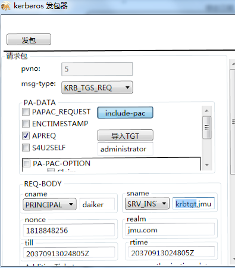
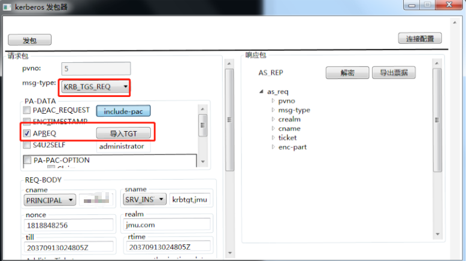
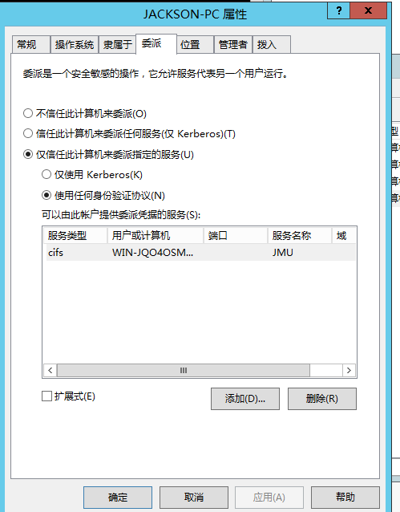
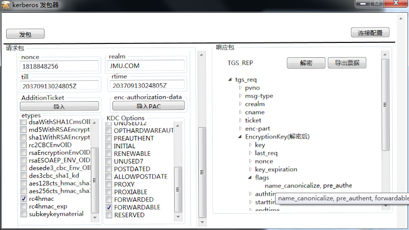
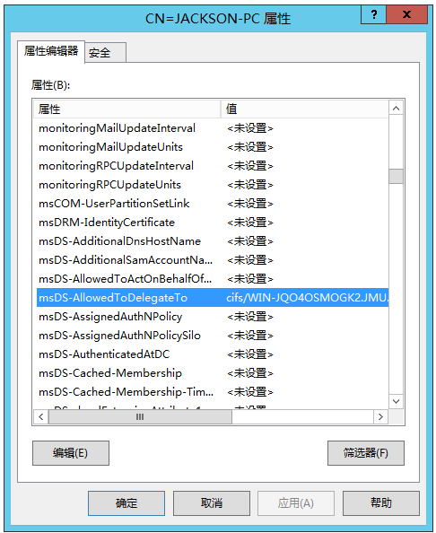
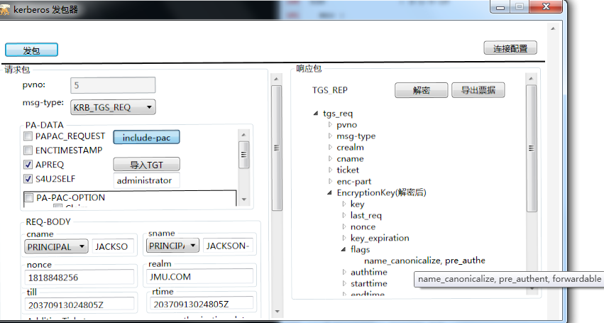
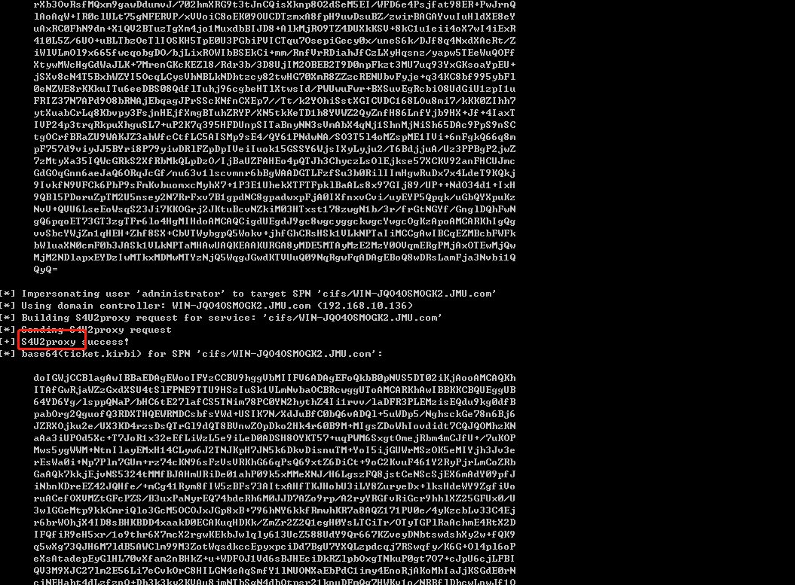
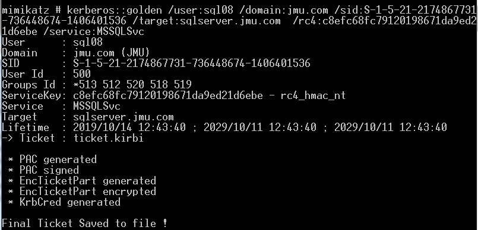
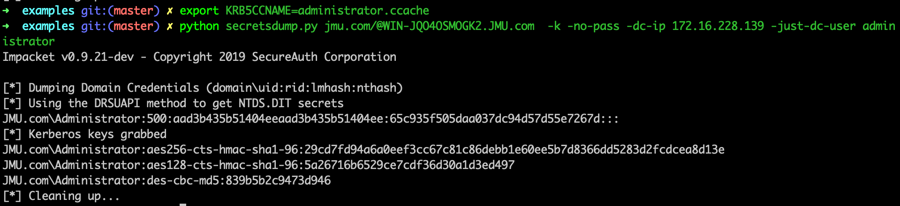
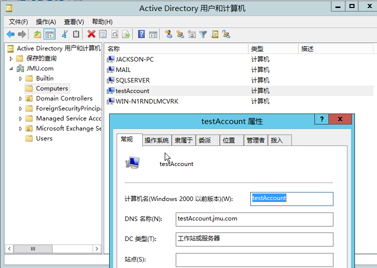

# Kerberos篇之TGS_REQ& TGS_REP

## 0x00前言

这篇文章是kerberos篇的第二篇TGS_REQ& TGS_REP。在TGS_REQ & TGS_REP阶段，用户通过AS_REP拿到的TGT票据，去向KDC申请特定服务的访问权限，KDC校验TGT票据，如果校验通过的话，会向用户发送一个TGS票据，之后用户再拿着TGS去访问特定的服务。这一阶段，微软引进了两个扩展S4U2SELF和S4U2PROXY。考虑到这两个扩展是TGS的子协议，把S4U归纳到这篇文章里面一起讲。

TGS_REQ这个阶段不需要账号密码，需要AS_REP获取到的TGT凭据。这里面工具需要指定域控的地址。连接配置里面的其他信息都在凭据里面，这里可以不用指定。


## 0x01 TGS_REQ 



这里面标注的字段是跟AS_REQ里面不一样的，在AS_REQ文档有标注，一样的内容就不再标注了。

### 1. msg-type

类型，TGS_REQ对应的就是KRB_TGS_REQ(0x0c)

### 2. PA-DATA

正常的TGS_REQ的请求需要用到有

- AP_REQ


这个是TGS_REQ必须携带的部分，这部分会携带AS_REP里面获取到的TGT票据，就放在这个结构体里面。

KDC校验TGT票据，如果票据正确，就返回TGS票据。


- PA_FOR_USER


类型是S4U2SELF

值是一个唯一的标识符，该标识符指示用户的身份。该唯一标识符由用户名和域名组成。

S4U2proxy 必须扩展PA_FOR_USER结构，指定服务代表某个用户(图片里面是administrator)去请求针对服务自身的kerberos服务票据。

- PA_PAC_OPTIONS


类型是 PA_PAC_OPTIONS

值是以下flag的组合

​    -- Claims(0)

​    -- Branch Aware(1)

​    -- Forward to Full DC(2)

​    -- Resource-based Constrained Delegation (3)

微软的[MS-SFU 2.2.5](https://docs.microsoft.com/en-us/openspecs/windows_protocols/ms-sfu/aeecfd82-a5e4-474c-92ab-8df9022cf955)， S4U2proxy 必须扩展PA-PAC-OPTIONS结构。

如果是基于资源的约束委派，就需要指定Resource-based Constrained Delegation位。

### 3. REQ_BODY

- sname

  这个是要请求的服务，TGS_REP获得的ticket是用该服务用户的hash进行加密的。有个比较有意思的特性是，如果指定的服务是krbtgt，那么拿到的TGS票据是可以当做TGT票据用的。

- AddtionTicket

  

  附加票据，在S4U2proxy请求里面，既需要正常的TGT，也需要S4U2self阶段获取到的TGS，那么这个TGS就添加到AddtionTicket里面。

  

## 0x02 TGS_REP


### 1. msg-type

AS_REQ的响应body对应的就是KRB_TGS_REQ(0x0d)

### 2. ticket

这个ticket用于AP_REQ的认证。其中里面的enc_part是加密的，用户不可读取里面的内容。在AS_REQ请求里面是，是使用krbtgt的hash进行加密的，而在TGS_REQ里面是使用要请求的服务的hash加密的。因此如果我们拥有服务的hash就可以自己制作一个ticket，既白银票据。详情见[相关的安全问题>白银票据](#相关的安全问题).正因为是使用要请求的服务的hash加密的，所以我们可以通过爆破enc_part获得该服务的hash,详情见[相关的安全问题>kerberoasting](#相关的安全问题)。

### 3. enc_part

注意，这个enc_part不是ticket里面的enc_part，


这部分是可以解密的，key是上一轮AS_REP里面返回的session_key,也就是导入凭据里面的 session_key，解密后得到encryptionkey，encryptionkey这个结构里面最重要的字段也是session_key(但是这个session_key 不同于上一轮里面的session_key)，用来作为作为下阶段的认证密钥。


## 0x03 S4U2SELF

S4U2self 使得服务可以代表用户获得针对服务自身的kerberos服务票据。这使得服务可以获得用户的授权( 可转发 的用户TGS票据)，然后将其用于后期的认证(主要是后期的s4u2proxy)，这是为了在用户以不使用 Kerberos 的方式对服务进行身份验证的情况下使用。**这里面很重要的一点是服务代表用户获得针对服务自身的kerberos票据这个过程，服务是不需要用户的凭据的**

s4u2self的过程如下图所示

  

前提条件是服务已经有通过KDC验证的TGT，如图，需要有TGT。



在步骤1中, 服务(`JACKSON-PC$`)使用S4U2self扩展名代表用户(`administrator`)获得针对服务本身(`JACKSON-PC$`)的服务票证。该服务将填写[PA_FOR_USER](https://docs.microsoft.com/en-us/openspecs/windows_protocols/MS-SFU/aceb70de-40f0-4409-87fa-df00ca145f5a) 数据结构,类型为`S4U2SELF`，并将KRB_TGS_REQ消息发送到TGS。 如下图，由于服务`JACKSON-PC$`代表用户向服务本身(也是`JACKSON-PC$`)发起请求，因此这里面cname是`JACKSON-PC$`,sname也是`JACKSON-PC$`


假定TGS支持PA_FOR_USER扩展，则TGS在步骤2中通过KRB_TGS_REP消息返回用户的服务票证。如果服务请求了可转发选项，并且TGS的本地策略允许，则TGS检验通过后必须将**票证标志** 字段设置为可转发，既只要满足

(1) TGT是可以转发的 


(2) 服务配置了约束委派



(3) 服务请求了可转发选项


 则TGS必须将**票证标志** 字段设置为可转发




需要注意的是，如果用户的UserAccountControl字段中设置了USER_NOT_DELEGATED位,那么返回的TGS是永远也没法转发的。如图，当Administrator配置了敏感账户，不能被委派，返回的TGS的flag字段没有forwardable。

 


## 0x04 S4U2PROXY

s4u2proxy 使得服务1可以使用来自用户的授权( 在S4U2SELF阶段获得)，然后用该TGS(放在AddtionTicket里面)向KDC请求访问服务2的TGS，并且代表用户访问服务2，而且只能访问服务2。

s4u2proxy的过程如下图所示:

  


在步骤1中，服务1试图代表用户获取服务2的服务票证。服务1发送KRB_TGS_REQ消息，并将用户的服务1服务票证作为 请求中的AddtionTicket。只要满足以下条件

1. 拥有来自用户的授权( 在S4U2SELF阶段获得的TGS票据)，放在AddtionTicket里面。


2. 在请求的kdc-options中设置了CNAME-IN-ADDL-TKT标志。


3.  服务请求了可转发选项


4. 服务1 有到服务2的非约束委派，将服务2的SPN放在sname里面。


如果满足这些条件，则在步骤2中TGS会制作KRB_TGS_REP消息以返回服务票证。可转发标志将在服务票证中设置。


有个点需要注意的是，前面在S4U2SELF里面提到，在满足一定的条件之后，S4U2SELF返回的票据是可以转发的，这个票据作为S4U2PROXY的AddtionTicket，有些文章里面会说，S4U2PROXY要求AddtionTicket里面的票据一定要是可转发的，否则S4U2PROXY生成的票据是不可以转发的。这个说法在引入可资源约束委派的情况下，是不成立的，下面分情况具体说下。

1. AddtionTicket里面的票据是可转发的

如果AddtionTicket里面的票据是可转发的，只要KDC Options里面置forwarable位，那么返回的票据必须置为可转发的


2. AddtionTicket里面的票据是不可转发的

如果AddtionTicket中的服务票据未设置为可转发的，则KDC必须返回状态为STATUS_NO_MATCH的KRB-ERR-BADOPTION选项。除了一种情况之外，就是配置了服务1到服务2 的基于资源的约束委派，且PA-PAC-OPTION设置了Resource-Based Constrained Delegation标志位(这一例外的前提是S4U2SELF阶段模拟的用户没被设置为对委派敏感，对委派敏感的判断在S4U2SELF阶段，而不是S4U2PROXY阶段)。

AddtionTicket里面的票据是不可转发的


配置了服务1到服务2 的基于资源的约束委派


PA-PAC-OPTION设置了Resource-Based Constrained Delegation标志位


返回的TGS票据是可转发的


## 0x05 委派

在Windows 2000 Server首次发布Active Directory时，Microsoft必须提供一种简单的机制来支持用户通过Kerberos向Web Server进行身份验证并需要代表该用户更新后端数据库服务器上的记录的方案。这通常称为“ Kerberos双跳问题”，并且要求进行委派，以便Web Server在修改数据库记录时模拟用户。需要注意的一点是接受委派的用户只能是**服务账户**或者**计算机用户**。

### 1. 非约束委派

Microsoft在Windows 2000中实现了Kerberos“不受约束的委托”，从而启用了这种级别的委托。

非约束委派的配置如下


服务(如`JACKSON-PC$`) 被配置了非约束的委派，那么`JACKSON-PC$`可以接受任何用户的委派的去请求其他所有服务。在协议层面的实现就是，某个用户委托`JACKSON-PC$`去访问某个服务，那么这个用户会将 TGT（在TGS里面）发送到`JACKSON-PC$`并缓存到LSASS中，以方便以后使用。 然后`JACKSON-PC$`模拟用户去请求某个服务。


配置了非约束委派的用户的userAccountControl 属性有个FLAG位  TrustedForDelegation 

关于userAccountControl 每一位对应的意义可以看[Converting AD UserAccountControl Attribute Values](http://woshub.com/decoding-ad-useraccountcontrol-value/ ),(我们在LDAP篇也会详细介绍)，其中 TRUSTED_FOR_DELEGATION 对应是 0x80000 ，也就是 524288 。

### 2. 约束委派

 微软很早就意识到非约束委派并不是特别安全，在 Windows 2003上发布了"约束"委派。 其中包括一组 Kerberos 协议扩展，就是本文之前提到的两个扩展 S4U2Self 和 S4U2Proxy。配置它后，约束委派将限制指定服务器可以代表用户执行的服务。这需要域管理员特权(其实严谨一点是SeEnableDelegation特权，该特权很敏感，通常仅授予域管理员)才能为服务配置域帐户，并且将帐户限制为单个域。

约束委派的配置如下


计算机用户(既JACKSON-PC\$) 被配置了约束的委派，那么`JACKSON-PC$`可以接受任何用户的委派的去请求特定的服务。具体过程是收到用户的请求之后，首先代表用户获得针对服务自身的可转发的kerberos服务票据(S4U2SELF)，拿着这个票据向KDC请求访问特定服务的可转发的TGS(S4U2PROXY)，并且代表用户访问特定服务，而且只能访问该特定服务。

相较于非约束委派，约束委派最大的区别也就是配置的时候选择某个特定的服务，而不是所有服务。


配置了约束委派的用户的userAccountControl 属性有个FLAG位   TrustedToAuthForDelegation 。

关于userAccountControl 每一位对应的意义可以看[Converting AD UserAccountControl Attribute Values](http://woshub.com/decoding-ad-useraccountcontrol-value/ ),其中  TRUSTED_TO_AUTH_FOR_DELEGATION  对应是  0x1000000 ，也就是  16777216 。

约束的资源委派，除了配置TRUSTED_TO_AUTH_FOR_DELEGATION  之外，还有个地方是存储对哪个spn 进行委派的，位于msDS-AllowedToDelegateTo 



最后来理一理约束委派的整个流程。

主要是有四个角色的存在：

1. 访问服务的用户(这里面是administrator)
2. 接受委派的服务1(这里面是JACKSON-PC$）
3. 要访问的服务2(这里面是CIFS/WIN-JQO4OSMOGK2.JMU.com)
4. KDC（Key Distribution Center）密钥分发中心 kerberos 

首先先做一些配置。配置服务1 到服务2的约束委派


整个完整的流程是

1. 服务1 使用自己的hash向KDC申请一个TGT票据，注意在KDC Option里面选择FORWARDABLE标志位，这样的话请求的TGT票据就是可转发的TGT票据。


2. 服务1 代表用户申请一个获得针对服务1自身的kerberos服务票据(这一步就是S4U2SELF，对于这一步有疑问的可以返回前面的S4U2SLEF看看)，这一步生成的TGS票据是可转发的TGS票据。



3. 服务1可以使用来自用户的授权( 在S4U2SELF阶段获得的可转发的TGS)，然后用该TGS(放在AddtionTicket里面)向KDC请求访问服务2的TGS


### 3. 基于资源的约束委派

为了配置受约束的委派，必须拥有SeEnableDelegation特权，该特权很敏感，通常仅授予域管理员。为了使用户/资源更加独立，Windows Server 2012中引入了基于资源的约束委派。基于资源的约束委派允许资源配置受信任的帐户委派给他们。基于资源的约束委派将委派的控制权交给拥有被访问资源的管理员。

基于资源的约束委派只能在运行Windows Server 2012 R2和Windows Server 2012的域控制器上配置，但可以在混合模式林中应用。

这种约束委派的风格与传统约束委派非常相似，但配置相反。从帐户A到帐户B的传统约束委派在msDS-AllowedToDelegateTo属性中的帐户A上配置，并定义从A到B的“传出”信任，而在msDS-AllowedToActOnBehalfOfOtherIdentity属性中的帐户B上配置基于资源的约束委派，并定义从A到B的“传入”信任，见下图。

  

最后来理一理基于资源的约束委派的整个流程。

主要是有四个角色的存在：

1. 访问服务的用户(这里面是administrator)
2. 接受委派的服务1(这里面是JACKSON-PC$）
3. 要访问的服务2(这里面是CIFS/WIN-JQO4OSMOGK2.JMU.com)
4. KDC（Key Distribution Center）密钥分发中心 kerberos 

首先先做一些配置。在服务2上 配置服务1 到服务2的基于资源的约束委派(不同于传统的约束委派需要域管的权限才能配置，只有拥有服务2 的权限就可以配置基于资源的约束委派)


整个完整的流程是

1. 服务1 使用自己的hash向KDC申请一个TGT票据。


2. 服务1 代表用户申请一个获得针对服务1自身的kerberos服务票据(这一步就是S4U2SELF，这一步就区别传统的约束委派，在S4U2SELF里面提到，返回的TGS可转发的一个条件是服务1配置了传统的约束委派，kdc会检查服务1 的TrustedToAuthForDelegation位和msDS-AllowedToDelegateTo  这个字段，由于基于资源的约束委派，是在服务2配置，服务2的msDS-AllowedToActOnBehalfOfOtherIdentity属性配置了服务1 的sid，服务1并没有配置TrustedToAuthForDelegation位和msDS-AllowedToDelegateTo 字段。因此这一步返回的TGS票据是不可转发的。


3. 服务1可以使用来自用户的授权( 在S4U2SELF阶段获得的不可转发的TGS)，然后用该TGS(放在AddtionTicket里面)向KDC请求访问服务2的可转发的TGS


## 0x06 相关的安全问题

### 1. pass the ticket

Kerbreos 除了第一步AS_ERQ是使用时间戳加密用户hash验证之外，其他的步骤的验证都是通过票据，这个票据 可以是TGT票据或者TGS票据。因为票据里面的内容主要是session_key和ticket(使用服务hash加密的，服务包括krbtgt)，拿到票据之后。我们就可以用这个票据来作为下阶段的验证了。

### 2. kerberosting

正因为TGS_REP里面ticket里的enc_part(是ticket里面的enc_part,不是最外层的enc_part,最外层的enc_part是使用AS_REP里面的session_key加密的，这个session_key我们已经有了，没有意义)


是使用要请求的服务的hash加密的，所以我们可以通过爆破获得服务的hash。这个问题存在的另外一个因素是因为用户向KDC发起TGS_REQ请求，不管用户对服务有没有访问权限，只要TGT正确，那么肯定会返回TGS。其实AS_REQ里面的服务就是krbtgt，也就是说这个同样用于爆破AS_REP里面的ticket部分的encpart得到krbtgt的hash，但是之所以在网上没见到这种攻击方式是因为krbtgt的密码是随机生成的，也跑不出来.

 sname 部分填写要爆破部分的spn


然后按照`format("$krb5tgs${0}$*{1}${2}${3}*${4}${5}", encType, userName, domain, spn, cipherText.Substring(0, 32), cipherText.Substring(32))`就可以拼接处hash cat(13100)能跑的hash。


这里面只做漏洞原理演示。方便的工具化的利用参见[部分相关的工具](#部分相关的工具)


### 3. 白银票据

在TGS_REP里面的ticket的encpart是使用服务的hash进行加密的，如果我们拥有服务的hash，就可以给我们自己签发任意用户的TGS票据，这个票据也被称为白银票据。相较于黄金票据，白银票据使用要访问服务的hash，而不是krbtgt的hash，由于生成的是tgs票据，不需要跟域控打交道，但是白银票票据只能访问特定服务。但是要注意的一点是，伪造的白银票据没有带有有效KDC签名的PAC。如果将目标主机配置为验证KDC PAC签名(关于PAC的详细信息，将在下一篇文章里面详细介绍)，则银票将不起作用。

### 4. 非约束委派攻击

非约束委派的安全问题就是如果我们找到配置了非约束的委派的账户，比如这里面的`JACKSON-PC$`，并且通过一定手段拿下该账户的权限，然后诱导域管访问该`JACKSON-PC$`，这个时候域管会将自己TGT发送到`JACKSON-PC$`并缓存到LSASS中，那我们就可以从LSASS中导出域管的TGT票据，然后通过PTT，从而拥有域管的权限。

1. 找到配置了非约束的委派的账户

因为配置非约束的委派的账户的UserAccount 配置了TRUSTED_FOR_DELEGATION flag位，TRUSTED_FOR_DELEGATION 对应是 0x80000 ，也就是 524288 。

所以对应的LDAP过滤规则是

`(&(objectCategory=computer)(objectClass=computer)(userAccountControl:1.2.840.113556.1.4.803:=524288))`

可以通过这个规则进行查找

以adfind为例(其他支持ldap的工具都可以实现)


2. 通过一定手段拿下这台配置了非约束委派的账户的权限(比如这里面的`JACKSON-PC$`)
3. 通过一定手段(比如通过打印机的那个漏洞)诱导域管访问我们拿下的配置了非约束委派的账户
4. 最后导出票据然后进行pass the ticket

### 5. 约束委派攻击

约束委派的安全问题就是如果我们找到配置了约束委派的服务账号，比如这里面的`JACKSON-PC$`，并且通过一定手段拿下该账号所在的机子。我们就可以利用这个服务账号代表任意用户(**这里面很重要的一点是服务代表用户获得针对服务自身的kerberos票据这个过程，服务是不需要用户的凭据的**)进行s4u2self获得一个可转发的票据，然后把获取到的票据用于s4u2proxy(作为AddtionTicket)，从未获取一个可转发的TGS，服务就可以代替任意用户访问另外一个服务(既被配置的约束委派的服务，这里面就是cifs/WIN-JQO4OSMOGK2.JMU.com）。

相较于非约束的委派，约束的委派并不需要用户过来访问就可以代表该用户，但是只能访问特定的服务(对于 HOST SPN，则可以实现完全的远程接管。 对于 MSSQLSvc SPN，则可以拿到 DBA 权限。 对于 CIFS SPN 则可以实现完全的远程文件访问。对于 HTTP SPN 则可能实现接管远程网络服务，而对于 LDAP 则可以执行 DCSync;) ，对于 HTTP 或 SQL 服务帐户，即使它们没有提升目标服务器上的管理员权限，也可能使用 Rotten Potato  进一步滥用，提权至 SYSTEM 的权限)，不像非约束的委派哪个可以访问任意服务。

1. 找到配置了非约束的委派的服务账户1

因为配置非约束的委派的机子的UserAccount 配置了TRUSTED_TO_AUTH_FOR_DELEGATION flag位，TRUSTED_TO_AUTH_FOR_DELEGATION  对应是  0x1000000 ，也就是  1677721

所以对应的LDAP过滤规则是

`(&(objectCategory=computer)(objectClass=computer)(userAccountControl:1.2.840.113556.1.4.803:=16777216))`

以adfind为例(其他支持ldap的工具都可以实现)


2. 找到该服务账号委派1委派的服务账户2

约束的资源委派，除了配置TRUSTED_TO_AUTH_FOR_DELEGATION  之外，还有个地方是存储对哪个spn 进行委派的，位于msDS-AllowedToDelegateTo ，查询该服务账号的msDS-AllowedToDelegateTo位


3. 通过一定手段拿下这个服务账户1

4. 发起一个从服务1到服务2的正常的约束委派的流程，从而访问服务2

   这个流程见上面的[委派>约束委派](#委派)，使用rubeus也可以很方便得进行一键访问，详细利用见[部分相关工具>rubrus>s4u](#部分相关工具))，从而访问到这个服务账户委派的服务


使用约束委派也可以很方便得留下后门，如果我们配置了服务1到服务2的约束委派，那么只要我们控制服务1，也就可以访问服务2。服务2可以是任何服务。比如服务2是krbtgt，那么只要我们控制着服务1，那么模拟任意用户最后生成的TGS就是任意用户的TGT，这算是一种变形的黄金票据。如果服务2是CIFS/域控计算账户，那么只要我们控制着服务1，是不是就可以随时从域控里面提取任意用户的hash。思路挺多的，懂得约束委派的原理就可以自己扩展。


### 6. 基于资源的约束委派攻击


基于资源的约束委派具有传统的约束委派的所有安全问题，但是相较于传统的约束委派。基于资源的约束委派的利用又相对较为简单。

主要体现为，普通的约束委派的配置需要SeEnableDelegation权限，而这个权限通常仅授予Domain Admins。因此我们对普通的约束委派的利用，往往在于寻找域内已有的约束委派，再利用。但是对于基于资源的约束委派，假如我们已经拥有服务账号1，那么只要我们具备用户2的LDAP权限，这样就可以配置服务1对服务2的约束委派(在服务账户2的用户属性上配置msDS-AllowedToActOnBehalfOfOtherIdentity为1的sid)，服务1就可以控制服务2。

所以基于资源的约束委派的利用，就有一种新的攻击思路

1. 我们拥有一个任意的服务账户1 或者计算机账户1

这一步不难，我们我们拥有域内机器，提升到system权限，该计算机用户，用户名为计算机账号$就是服务账号。如果我们只有普通的域内用户，可以滥用MachineAccountQuota,详细细节见[ 部分相关的工具>Powermad]( #部分相关的工具)

2. 我们获得服务账户2 的LDAP权限

这一步可以结合ntlm relay，从其他协议relay 而来，关于这一步，更多的是ntlm relay的过程，限于篇幅原因，这里面会在ntlm篇的relay详细介绍。典型案例就是CVE2019-1040。

3. 配置服务1对服务2的约束委派

在服务账户2的用户属性上配置msDS-AllowedToActOnBehalfOfOtherIdentity为服务账户1的sid

4. 发起一个从服务1到服务2的正常的约束委派的流程，从而访问服务2。

这个流程见上面的[委派>约束委派](#委派)，使用rubeus也可以很方便得进行一键访问，详细利用见[部分相关工具>rubrus>s4u](#部分相关工具))

## 0x07 部分相关工具

### 1. rubeus

- asktgs

这个功能用于发送tgs请求包，并将凭据以base64打印出来。


- kerberoasting

Rubes里面的`kerberoast`支持对所有用户或者特定用户执行kerberoasting操作，其原理在于先用LDAP查询于内的spn，再通过发送TGS包，提取拼接得到hashcat或者john能爆破的格式。


- monitor/harvest

这个模块用于非约束委派的利用

rubeus的monitor或者harvest模块会从日志里面过滤出 4624 ，然后提取TGT票据打印出来。


提取完之后是base64，可以利用powershell 导出为kirbi格式的文件(注意回车换行，然后就可以使用mimikatz的ptt，rubeus的ptt，或者转化为ccache使用impacket的ptt都可以，然后rubeusde ptt是支持base64的)

```
[IO.File]::WriteAllBytes("ticket.kirbi", [Convert]::FromBase64String("aa..."))
```

- s4u

rubeus的s4u支持一条命令发起一个约束委派的流程





### 2. mimikatz

- kerberos::golden

mimikatz的kerberos::golden模块可以用于制作白银票据,票据格式是`.kirbi`

利用已知的服务账号的密码(如通过kerberosting)计算出hash

```
python -c 'import hashlib,binascii; print binascii.hexlify(hashlib.new("md4", "p@Assword!123".encode("utf-16le")).digest())'
```


获取sid


制作白银票据



- kerberos::ptt

mimikatz的kerberos::ptt 模块可以用于 pass the ticket


- sekurlsa::tickets

kerberos 的sekurlsa::tickets 可用于导出票据

对于非约束委派，使用mimikatz利用如下

(1) 通过adfind 寻找具有非约束委派的机子


(2) 打下jackson-PC

然后使用钓鱼或者打印机哪个漏洞，诱导域管过来访问jackson-PC


(3) 在jackson-PC使用mimikatz 导出域管的TGT(因为要从lsass里面导出来，所以需要本机管理员的权限)


（4）ptt


### 3. impacket

在impakcet里面很多程序都支持`pass the key`,只需要

```bash
export KRB5CCNAME=/path/to/ccache/file
```

然后在需要`pass the key`的程序里面加`-k -no-pass`就行。

以`secretsdump.py`为例



Impact 里面跟TGT_REQ相关的脚本主要有3个。

- getST.py

在ccache中输入密码，哈希，aesKey或TGT后，此脚本将请求服务票证并将其另存为ccache。


- GetUserSPNs.py

此示例将尝试查找和获取与普通用户帐户关联的服务主体名称。输出与JtR和HashCat兼容。


- ticketer.py

该脚本将从零开始或基于模板（从KDC合法请求）创建Golden / Silver票据，允许您自定义PAC_LOGON_INFO结构中设置的一些参数，特别是组，ExtraSids，持续时间等，票据格式是`ccache`.

利用已知的服务账号的密码(如通过kerberosting)计算出hash

```
python -c 'import hashlib,binascii; print binascii.hexlify(hashlib.new("md4", "p@Assword!123".encode("utf-16le")).digest())'
```


获取域的sid


制作白银票据


在使用白银票据进行 传递的时候会出现KRB_AP_ERR_MODIFIED(Message stream modified)，尚未解决


### 4. [kerberoast](https://github.com/nidem/kerberoast)

Kerberoast是用于攻击MS Kerberos实现的一系列工具

用系统内置的工具setspn提取出所有的spn

```
> setspn  -Q */*
```


请求票据

```
> Add-Type -AssemblyName System.IdentityModel  
> New-Object System.IdentityModel.Tokens.KerberosRequestorSecurityToken -ArgumentList "MSSQLSvc/sqlserver.jmu.com:1433"  
```


从 Mimikatz 里面提取票据

```
mimikatz # kerberos::list /export
```


使用 tgsrepcrack 爆破票据

```
./tgsrepcrack.py wordlist.txt 1-MSSQLSvc~sql01.medin.local~1433-MYDOMAIN.LOCAL.kirbi
```


### 5. [Powermad]( https://github.com/Kevin-Robertson/Powermad )

默认的Active Directory ms-DS-MachineAccountQuota属性设置允许所有域用户向一个域中最多添加10个计算机帐户。


Powermad包括一组用于利用ms-DS-MachineAccountQuota的功能，而无需将实际系统附加到AD。




这个时候的账户还没有在DNS服务器里面注册


添加个DNS记录


