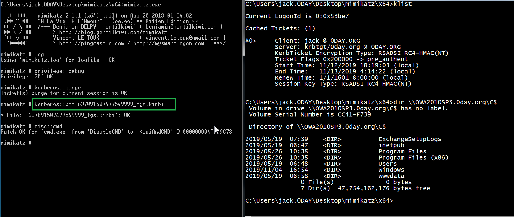

# Kerberos篇之PAC


## 0x00 前言
这是kerbreos篇的最后一篇文章了。这篇文章主要讲的内容是微软为了访问控制而引进的一个扩展PAC，以及PAC在历史上出现过的一个严重的，允许普通用户提升到域管的漏洞MS14068。
## 0x01 PAC 介绍

网上很多版本的kerberos的流程是

1. 用户向KDC发起AS_REQ,请求凭据是用户hash加密的时间戳，KDC使用用户hash进行解密，如果结果正确返回用krbtgt hash加密的TGT票据
2. 用户凭借TGT票据向KDC发起针对特定服务的TGS_REQ请求，KDC使用krbtgt hash进行解密，如果结果正确，就返回用服务hash 加密的TGS票据
3. 用户拿着TGS票据去请求服务，服务使用自己的hash解密TGS票据。如果解密正确，就允许用户访问。


上面这个流程看起来没错，却忽略一个最重要的因素，那就是用户有没有权限访问该服务，在上面的流程里面，只要用户的hash正确，那么就可以拿到TGT，有了TGT，就可以拿到TGS，有了TGS，就可以访问服务，任何一个用户都可以访问任何服务。也就是说上面的流程解决了"Who am i?"的问题，并没有解决 "What can I do?"的问题。

为了解决上面的这个问题，微软引进了PAC，引进PAC之后的kerberos流程变成

1. 用户向KDC发起AS_REQ,请求凭据是用户hash加密的时间戳，KDC使用用户hash进行解密，如果结果正确返回用krbtgt hash加密的TGT票据，**TGT里面包含PAC,PAC包含用户的sid，用户所在的组**。


1. 用户凭借TGT票据向KDC发起针对特定服务的TGS_REQ请求，KDC使用krbtgt hash进行解密，如果结果正确，就返回用服务hash 加密的TGS票据(**这一步不管用户有没有访问服务的权限，只要TGT正确，就返回TGS票据，这也是kerberoating能利用的原因，任何一个用户，只要hash正确，可以请求域内任何一个服务的TGS票据，具体内容可以参考[Windows内网协议学习Kerberos篇之TGSREQ& TGSREP](https://www.anquanke.com/post/id/190625)**)
2. 用户拿着TGS票据去请求服务，服务使用自己的hash解密TGS票据。如果解密正确，**就拿着PAC去KDC那边询问用户有没有访问权限，域控解密PAC。获取用户的sid，以及所在的组，再判断用户是否有访问服务的权限，有访问权限(有些服务并没有验证PAC这一步，这也是白银票据能成功的前提，因为就算拥有用户hash，可以制作TGS，也不能制作PAC，PAC当然也验证不成功，但是有些服务不去验证PAC，这是白银票据成功的前提）**就允许用户访问。


特别说明的是，PAC对于用户和服务全程都是不可见的。只有KDC能制作和查看PAC。

## 0x02 PAC结构

PAC的结构如下图所示。


PAC整体的结构上是一个AuthorizationData的结构

```
AuthorizationData       ::= SEQUENCE OF SEQUENCE {
              ad-type         [0] Int32,
              ad-data         [1] OCTET STRING
 }
```

AuthorizationData结构的ad-type主要有以下几个

```
AD-IF-RELEVANT                     1
AD-INTENDED-FOR-SERVER             2
AD-INTENDED-FOR-APPLICATION-CLASS  3
AD-KDC-ISSUED                      4
AD-AND-OR                          5
AD-MANDATORY-TICKET-EXTENSIONS     6
AD-IN-TICKET-EXTENSIONS            7
AD-MANDATORY-FOR-KDC               8
Reserved values                 9-63
OSF-DCE                           64
SESAME                            65
AD-OSF-DCE-PKI-CERTID             66 (hemsath @us.ibm.com)
AD-WIN2K-PAC                     128 (jbrezak @exchange.microsoft.com)
AD-ETYPE-NEGOTIATION             129  (lzhu @windows.microsoft.com)
```

如上图所示，整个PAC最外层的ad-type为`AD-IF-RELEVANT`，ad-data还是一个AuthorizationData结构。

这个AuthorizationData的ad-type 为`AD-WIN2K-PAC`，ad-data为一段连续的空间，

这段空间包含一个头部`PACTYPE`以及若干个`PAC_INFO_BUFFER`

头部PACTYPE包括`cBuffers`,`版本`以及`缓冲区`，`PAC_INFO_BUFFER`为key-value型的

key 的类型如下表所示

| 类型 | 意义 |
| ---------- | ------------------------------------------------------------ |
| 0x00000001 | 登录信息。PAC结构必须包含一个这种类型的缓冲区。其他登录信息缓冲区必须被忽略。 |
| 0x00000002 | 凭证信息。PAC结构不应包含多个此类缓冲区。第二或后续凭证信息缓冲区在接收时必须被忽略。 |
| 0x00000006 | 服务器校验和。PAC结构必须包含一个这种类型的缓冲区。其他登录服务器校验和缓冲区必须被忽略。 |
| 0x00000007 | KDC（特权服务器）校验和（第2.8节）。PAC结构必须包含一个这种类型的缓冲区。附加的KDC校验和缓冲区必须被忽略。 |
| 0x0000000A | 客户名称和票证信息。PAC结构必须包含一个这种类型的缓冲区。附加的客户和票据信息缓冲区必须被忽略。 |
| 0x0000000B | 受约束的委派信息。PAC结构必须包含一个S4U2proxy请求的此类缓冲区，否则不包含。附加的受约束的委托信息缓冲区必须被忽略。 |
| 0x0000000C | 用户主体名称（UPN）和域名系统（DNS）信息。PAC结构不应包含多个这种类型的缓冲区。接收时必须忽略第二个或后续的UPN和DNS信息缓冲区。 |
| 0x0000000D | 客户索取信息。PAC结构不应包含多个这种类型的缓冲区。附加的客户要求信息缓冲区必须被忽略。 |
| 0x0000000E | 设备信息。PAC结构不应包含多个这种类型的缓冲区。附加的设备信息缓冲区必须被忽略。 |
| 0x0000000F | 设备声明信息。PAC结构不应包含多个这种类型的缓冲区。附加的设备声明信息缓冲区必须被忽略。 |

下面详细介绍四个比较重要的

- 0x00000001   **KERB_VALIDATION_INFO**  

这个结构是登录信息，也是整个PAC最重要的部分，整个PAC就靠它来验证用户身份了，是个结构体，如下

```
typedef struct _KERB_VALIDATION_INFO {
   FILETIME LogonTime;
   FILETIME LogoffTime;
   FILETIME KickOffTime;
   FILETIME PasswordLastSet;
   FILETIME PasswordCanChange;
   FILETIME PasswordMustChange;
   RPC_UNICODE_STRING EffectiveName;
   RPC_UNICODE_STRING FullName;
   RPC_UNICODE_STRING LogonScript;
   RPC_UNICODE_STRING ProfilePath;
   RPC_UNICODE_STRING HomeDirectory;
   RPC_UNICODE_STRING HomeDirectoryDrive;
   USHORT LogonCount;
   USHORT BadPasswordCount;
   ULONG UserId; //用户的sid
   ULONG PrimaryGroupId; 
   ULONG GroupCount;
   [size_is(GroupCount)] PGROUP_MEMBERSHIP GroupIds;//用户所在的组，如果我们可以篡改的这个的话，添加一个500(域管组)，那用户就是域管了。在ms14068 PAC签名被绕过，用户可以自己制作PAC的情况底下，pykek就是靠向这个地方写进域管组，成为使得改用户变成域管
   ULONG UserFlags;
   USER_SESSION_KEY UserSessionKey;
   RPC_UNICODE_STRING LogonServer;
   RPC_UNICODE_STRING LogonDomainName;
   PISID LogonDomainId;
   ULONG Reserved1[2];
   ULONG UserAccountControl;
   ULONG SubAuthStatus;
   FILETIME LastSuccessfulILogon;
   FILETIME LastFailedILogon;
   ULONG FailedILogonCount;
   ULONG Reserved3;
   ULONG SidCount;
   [size_is(SidCount)] PKERB_SID_AND_ATTRIBUTES ExtraSids;
   PISID ResourceGroupDomainSid;
   ULONG ResourceGroupCount;
   [size_is(ResourceGroupCount)] PGROUP_MEMBERSHIP ResourceGroupIds;
} KERB_VALIDATION_INFO;
```


- 0x0000000A    **PAC_CLIENT_INFO**   

1. 客户端Id（8个字节）：

   包含在Kerberos初始TGT的authtime

2. NameLength（2字节）

   用于指定Name 字段的长度（以字节为单位）。

3. Name

   包含客户帐户名的16位Unicode字符数组，格式为低端字节序。

- 0x00000006和0x00000007 
 0x00000006 对应的是服务检验和，0x00000007 对应的是KDC校验和。分别由server密码和KDC密码加密，是为了防止PAC内容被篡改。

 存在签名的原因有两个。首先，存在带有服务器密钥的签名，以防止客户端生成自己的PAC并将其作为加密授权数据发送到KDC，以包含在票证中。其次，提供具有KDC密钥的签名，以防止不受信任的服务伪造带有无效PAC的票证。

 两个都是PAC_SIGNATURE_DATA结构，他包括以下结构。
  1. SignatureType（4个字节）


| 类型       | 含义                   | 签名长度 |
| ---------- | ---------------------- | -------- |
| 0xFFFFFF76 | KERB_CHECKSUM_HMAC_MD5 | 16       |
| 0x0000000F | HMAC_SHA1_96_AES128    | 12       |
| 0x00000010 | HMAC_SHA1_96_AES256    | 12       |


2. Signature

  包含校验和。签名的长度由SignatureType字段的值确定
 3. RODCIdentifier（2个字节）：

     当KDC为RODC时，包含密钥版本号的前16位。当KDC不是RODC时，此字段不存在。

 


## 0x03 相关安全问题
#### 1. MS14068

补丁编号是KB3011780，域里面最严重的漏洞之一，它允许任意用户提升到域管权限。下面简要分析下该漏洞。

该漏洞最本质的地方在于**Microsoft Windows Kerberos KDC无法正确检查Kerberos票证请求随附的特权属性证书（PAC）中的有效签名**，这里面的签名就是上面提到的服务检验和以及KDC校验和。导致用户可以自己构造一张PAC。
签名原本的设计是要用到HMAC系列的checksum算法，也就是必须要有key的参与，我们没有krbtgt的hash以及服务的hash，就没有办法生成有效的签名，但是问题就出在，实现的时候允许所有的checksum算法都可以，包括MD5。那我们只需要把PAC 进行md5，就生成新的校验和。这也就意味着我们可以随意更改PAC的内容，完了之后再用md5 给他生成一个服务检验和以及KDC校验和。在MS14-068修补程序之后，Microsoft添加了一个附加的验证步骤，以确保校验和类型为KRB_CHECKSUM_HMAC_MD5。

在KERB_VALIDATION_INFO结构里面，我们看到有这两个字段。


其中GroupId是用户所在所在的组，那只要我们把重要组(比如域管组)的sid加进GroupId。那么服务拿这用户的TGS去询问域管用户是否有访问访问改服务的权限的时候，域控会解密PAC，提取里面用户的sid，以及所在的组(GroupId)，我们已经把域管加进去了，是的域控把把这个用户当做域管组里面的成员。从而达到提升为域管的效果。pykek加入的是以下组,

- 域用户（513）
- 域管理员（512）
- 架构管理员（518）
- 企业管理员（519）
- 组策略创建者所有者（520）

现在我们已经能够伪造pac,将我们放在域管的组里，然后伪造检验和。但是即使用户可以伪造PAC。该漏洞的利用依旧还有一个棘手的问题。
前面我们说过。PAC是包含在TGT里面的,而TGT是krbtgt的用户hash加密的，也就意味着即使我们可以伪造PAC，那我们有什么办法讲PAC放在票据里面传输给KDC呢。漏洞的作者用了一个很巧妙的方式。通过查看pykek的源码发现，
作者将PAC加密成密文放在enc-authorization-data里面，enc-authorization-data的结构如下

```
 AuthorizationData::= SEQUENCE OF SEQUENCE {
    ad-type[0] Int32,
    ad-data[1] OCTET STRING
 }
```
ad-type是加密算法
ad-data是pac加密后的内容
加密用的key是客户端生成的。KDC并不知道这个key。KDC会从PA-DATA里面的AP_REQ获取到这个key。从而对ad-data进行解密，然后拿到PAC，再检查校验和。
可能很多人抓包,在AP_REQ里面并没有找到这个key。在上一篇文章里面对于AP_REQ介绍得不多。


只是说了TGT票据就放在这个结构体里面。这里补充介绍下。
AP_REQ的type是PADATA_TYPE.AP_REQ(INTEGER 1)

value是如下结构体

```
AP-REQ  ::= [APPLICATION 14] SEQUENCE {
        pvno            [0] INTEGER (5),
        msg-type        [1] INTEGER (14),
        ap-options      [2] APOptions,
        ticket          [3] Ticket,
        authenticator   [4] EncryptedData -- Authenticator
}
```
之前说的TGT票据放在这个结构体里面，就是放在ticket里面。
authenticator 的内容包括加密类型和用session_key加密Authenticator加密成的密文。
Authenticator的结构如下

```
Authenticator ::= [APPLICATION 2] SEQUENCE  {
     authenticator-vno       [0] INTEGER (5),
     crealm                  [1] Realm,
     cname                   [2] PrincipalName,
     cksum                   [3] Checksum OPTIONAL,
     cusec                   [4] Microseconds,
     ctime                   [5] KerberosTime,
     subkey                  [6] EncryptionKey OPTIONAL,
     seq-number              [7] UInt32 OPTIONAL,
     authorization-data      [8] AuthorizationData OPTIONAL
}
```
其中加密PAC的密钥就放在subkey里面。
大体流程就是KDC拿到AP_REQ之后，提取里面authenticator的密文，用session_key解密获得subkey，再使用subkey解密enc-authorization-data获得PAC.而PAC是我们自己伪造的.


所以最后梳理一下MS14068漏洞利用思路。

1.发起一个 PA_PAC_REQUEST里面选择include_pac 为false。此时生成的TGT票据是不含有PAC的


2.伪造一个PAC。sid为当前用户的sid。将如下组的 sid加进GroupId

    - 域用户（513）
    - 域管理员（512）
    - 架构管理员（518）
    - 企业管理员（519）
    - 组策略创建者所有者（520）

后续kerberos测试工具会加入制作PAC的功能，现在暂时不支持，我们直接利用pykek的代码来生成下，跟ms14068.py的同一文件夹底下，新建makepac.py,代码如下
```python
from kek.pac import build_pac
from kek.util import  gt2epoch
from kek.krb5 import AD_WIN2K_PAC,AuthorizationData,AD_IF_RELEVANT
from pyasn1.codec.der.encoder import encode
if __name__ == '__main__':
    user_realm = "0day.org" #改成自己的
    user_name = "jack" #改成自己的
    user_sid = "S-1-5-21-1812960810-2335050734-3517558805-1133" #改成自己的
    # logon_time = gt2epoch(str(as_rep_enc['authtime']))
    logon_time = gt2epoch('20191112101422Z')
    print(logon_time)
    authorization_data = (AD_WIN2K_PAC, build_pac(user_realm, user_name, user_sid, logon_time))
    ad1 = AuthorizationData()
    ad1[0] = None
    ad1[0]['ad-type'] = authorization_data[0]
    ad1[0]['ad-data'] = authorization_data[1]
    ad = AuthorizationData()
    ad[0] = None
    ad[0]['ad-type'] = AD_IF_RELEVANT
    ad[0]['ad-data'] = encode(ad1)
    data =  encode(ad)
    with open("jack.pac","wb") as f:
        f.write(data)
```

注意这里的logon_time来自于第一步中生成的AS_REP的enc_part解密后的的authtime，在工具里面右键复制就行


3.发起一次服务用户是krbtgt的TGS_REQ，此时导入的TGT里面是不含有PAC的(在第一步里面选择include=False返回的TGT不含有pac)，然后将我们伪造的PAC是加密放在 enc-authorization-data里面。加密用的key的放在PA-DATA里面的AP_REQ。此时返回的TGS里面就含有我们伪造的PAC。在之前的文章里面我们说过，在TGS里面，如果请求的服务是krbtgt的话，那么返回的TGS票据是可以当做TGT的。在我们的kerbreos测试工具里面，只需要导入上面makepac.py生成的pac文件。


4.Pass the ticket




这里面使用kerberos 测试工具只是为了理清楚漏洞流程。更为方便的利用请见底下。


## 0x04 部分相关的工具

### kekeo


### impacket

- goldenPac.py

这个工具是结合ms14-068加psexec


### msf

- ms14_068_kerberos_checksum

msf的这个模块也支持14068攻击利用


### pykek

全称是```Python Kerberos Exploitation Kit```

应该是ms14068漏洞利用，使用的最广泛的一个，一般常用的ms14068.exe，就是由他打包而成的


先获取sid


拼接成`S-1-5-21-866784659-4049716574-3063611777-1104`

生成tgt


验证tgt是否具备域管权限


