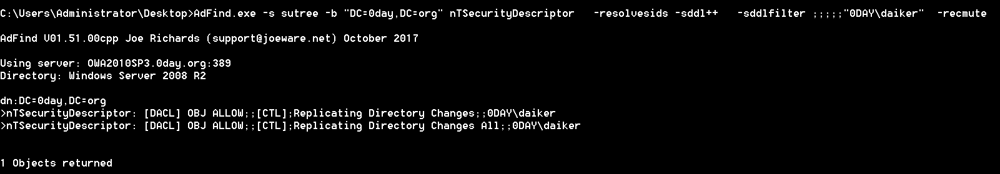
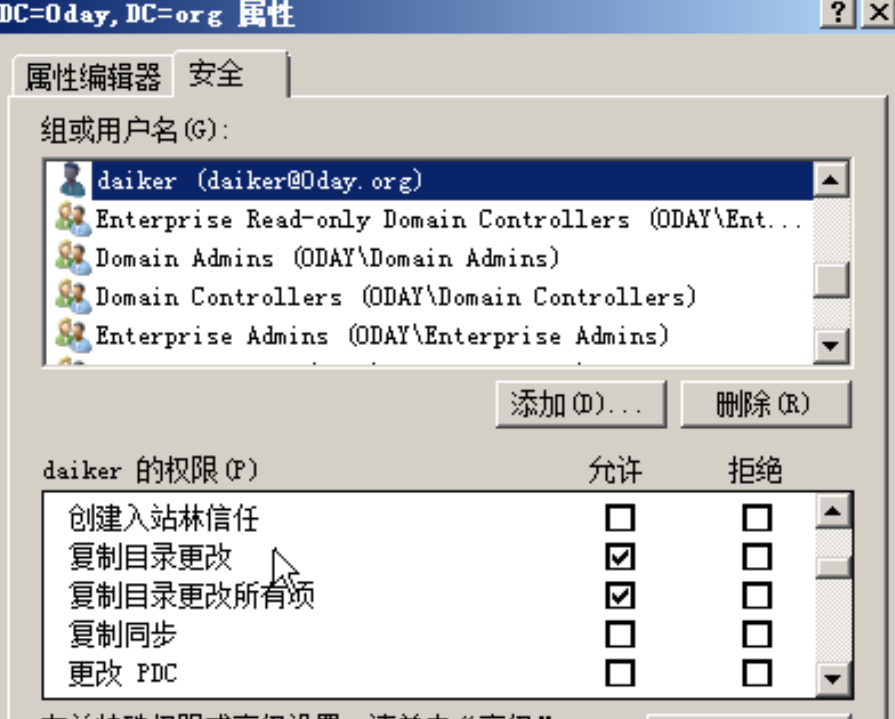
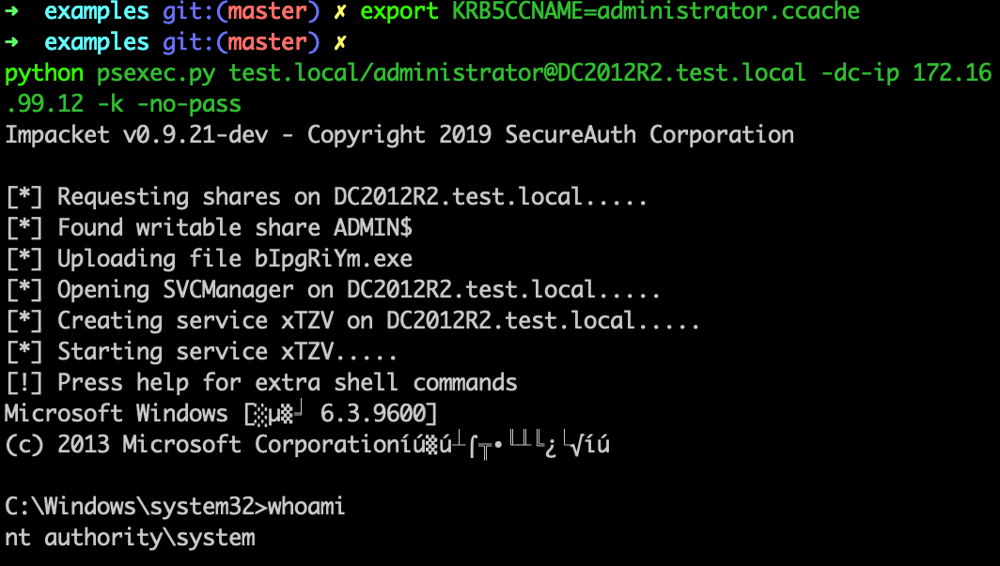
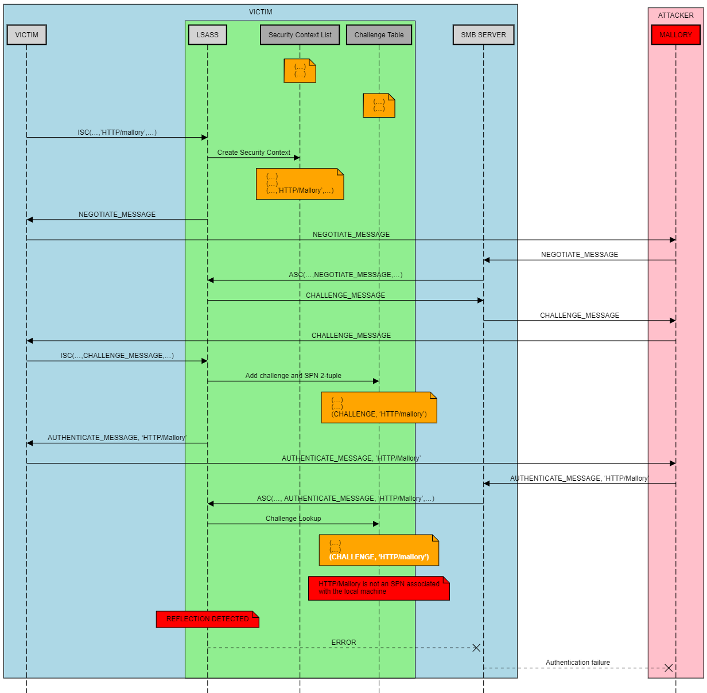
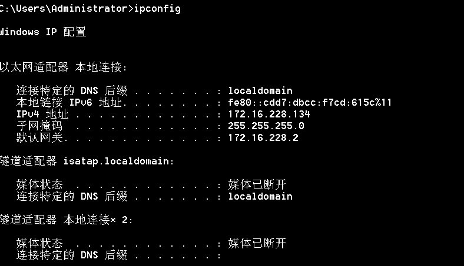

# NTLM篇之漏洞概述

## 0x00 前言

这是NTLM篇的最后一篇文章了，在之前已经花了三篇文章阐述了跟NTLM_Relay有关的方方面面的内容。在这篇文章里面将要介绍下签名，他决定了NTLM_Relay能不能利用成功。以及我们将会介绍跟NTLM_Relay相关的一些漏洞,MS08-068,MS16-074,CVE-2015-0005,CVE2019-1040,CVE-2019-1384，将整个NTLM_Relay漏洞利用串起来。在之后阐述NTLM_Relay漏洞利用链的时候，我们会主要从一下三方面阐述。

1. 怎么发起ntlm请求
2. 拿到ntlm 请求之后要做什么
3. 服务端是否要求签名

## 0x01 SMB签名 以及LDAP签名

### 1. 关于签名的一点细节

当认证完毕之后，使用一个客户端和服务端都知道的key 对后续所有的操作进行加密，攻击者由于没有key，也没法对内容进行加密解密，所以也就没办法进行Relay,最多只能将流量原封不动转发过去。那这个key是什么呢。之前在网上看到的一个说法就是这个key是session_key，需要使用用户hash去生成，攻击者没有用户hash(有也就不需要Relay了，直接pth多好)，所以没有session_key,也就是没办法加解密，这个时候签名也就起到了防御Relay的效果。

这种解释也没错，都说得通。直到有一天，我跟@xianyu师傅，在winrm的流量中发现了一个字段，session_key。高兴了很久，以为是微软的疏忽泄漏了session_key，那不就可以跟CVE-2015-0005一样绕过了签名从而进行relay了嘛。但是在进行一番研究之后，发现事情好像没有这么简单。在整个签名环节并非只有一个key。下面详细介绍下三个key，比较绕，大家大致理解下。(对于3个key的命名，不可地方表述不同)

1. exported_session_key

```python
def get_random_export_session_key():
    return os.urandom(16)
```

​	这个key是随机数。如果开启签名的话，客户端和服务端是用这个做为key进行签名的。

2. key_exchange_key

   这个key使用用户密码，Server Challenge,Client Challenge经过一定运算得到的。

   

3. encrypted_random_session_key

   前面说过开启签名的话，客户端是使用exported_session_key做为key进行加密解密的，而exported_session_key是客户端生成的随机数，那服务端不知道这个key。这个时候就需要协商密钥。encrypted_random_session_key的生成如下图所示，使用key_exchange_key做为Key,RC4加密算法加密exported_session_key。encrypted_random_session_key在流量显示是 Session Key.这个是公开的，在流量里面传输给服务端，服务端拿到这个的话，跟key_exchange_key一起运算得到exported_session_key，然后使用exported_session_key进行加解密。对于攻击者，由于没有用户hash，也就没办法生成key_exchange_key，虽然在流量里面能够拿到encrypted_random_session_key，但是没有key_exchange_key，也就没办法运算出exported_session_key，也就没法对流量进行加解密。从而进行Relay。

### 2. SMB 签名

有些地方表述为个人pc 默认没有开启smb签名，服务器计算机默认开启smb签名，在我实际测试中发现这个说法是不正确。在域内的默认设置是仅在域控制器上启用，域成员机器并没有启用。

### 3. LDAP 签名

在默认情况底下，ldap服务器就在域控里面，而且默认策略就是协商签名。而不是强制签名。也就是说是否签名是有客户端决定的。服务端跟客户端协商是否签名。(客户端分情况，如果是smb协议的话，默认要求签名的，如果是webadv或者http协议，是不要求签名的)微软公司于 2019-09-11 日发布相关通告称微软计划于 2020 年 1 月发布安全更新。为了提升域控制器的安全性，该安全更新将强制开启所有域控制器上 LDAP channel binding 与 LDAP signing 功能。

## 0x02 漏洞概览

### 1. MS08-068

在这之前，当拿到用户的smb请求之后，最直接的就是把请求Relay回用户本身，即Reflect。从而控制机子本身。漏洞危害特别高。微软在kb957097补丁里面通过修改SMB身份验证答复的验证方式来防止凭据重播，从而解决了该漏洞。防止凭据重播的做法如下:


主机A向主机B(访问\\\B)进行SMB认证的时候，将*pszTargetName*设置为`cifs/B`,然后在type 2拿到主机B发送Challenge之后，在lsass里面缓存(Challenge,`cifs/B`)。

然后主机B在拿到主机A的type 3之后，会去lsass里面有没有缓存(Challenge,`cifs/b`)，如果存在缓存，那么认证失败。

这种情况底下，如果主机B和主机A是不同的主机的话，那lsass里面就不会缓存(Challenge,`cifs/B`)。如果是同一台主机的话，那lsass里面肯定有缓存，这个时候就会认证失败。


### 2. CVE-2015-0005

本文前面说过，在签名的情况底下。对于攻击者，由于没有用户hash，也就没办法生成key_exchange_key，虽然在流量里面能够拿到encrypted_random_session_key，但是没有key_exchange_key，也就没办法算出exported_session_key，也就没法对流量进行加解密。从而进行Relay。

攻击者一旦拿到key_exchange_key的话，就可以进行Relay。而CVE-2015-0005正好是泄漏了这个key，因此这里单独拿出来说说。

之前的文章说过，在域内进行NTLM_RELAY的时候，如果登录的用户是域用户，这个时候认证服务器本地是没有域用户的hash的，这个时候会通过NETLOGON把type 1,type 2,type 3全部发给域控，让域控去判断。并不是向域控索要域用户的hash。那在认证之后，由于没有用户的hash，也没有办法算出key_exchange_key，这个时候认证服务器就会通过NETLOGON去找域控索要key_exchange_key。从而算出exported_session_key。

但是这个漏洞就出在，不是只有认证服务器才能找域控索要key_exchange_key，只要是机器用户来索要key_exchange_key，域控都会给，并没有做鉴权。我们拥有一个机器用户的话，可以去找域控索要key_exchange_key，然后跟流量里面的encrypted_random_session_key算出exported_session_key，使用exported_session_key进行加解密。


对于该漏洞，在impacket的`smbrelayx.py`已经集成


不需要指定额外的参数，当发现服务端要求进行签名的时候就会自动调用(当然，需要指定一个机器用户以及他的凭据，不然漏洞无法利用)


### 3. MS16-075

这个漏洞也叫Hot Potato，从这个漏洞引申出很多Potato，比如Rotten Potato，Ghost potato。

这是一个典型的NTLM_RELAY利用链。按照Relay的一般流程，我们从三方面着手，将思路串起来，达到本地提权的效果。

1. 怎么发起ntlm请求

   发起ntlm请求请求的方式我们最早在[Windows内网协议学习NTLM篇之发起NTLM请求](https://www.anquanke.com/post/id/193493#h3-15)里面已经说过，就是配合NBNS投毒欺骗和伪造WPAD代理服务器拿到用户的Net-NTML hash，所有的HTTP请求将会被重定向至“http://localhost/GETHASHESxxxxx””，其中的xxxxx表示的是某些唯一标识符。将会影响目标主机中所有的用户，包括管理员账户和系统账户。更多关于NBNS和wpad的细节，在之前的文章已经说过了，这里不再赘述。

2. 拿到ntlm 请求之后要做什么

   MS08-068虽然限制了同台主机之间smb到smb的Relay，但是并没有限制从http到smb，我们配置配合NBNS投毒欺骗和伪造WPAD代理服务器拿到的ntlm请求说http的形式，我们可以直接relay 到本机的smb。

3. 服务端是否要求签名

   我们Relay到的服务端协议是smb，除非是域内的域控，不然在工作组环节底下，或者域内的域成员机器，都是不要求签名的。

###  4. CVE-2018-8581

这个漏洞最早是一个SSRF漏洞。可以访问任意用户的邮件。

该漏洞由SSRF漏洞结合NTLM_RELAY可以访问任意用户的邮件，获取域管权限。按照Relay的一般流程，我们从三方面着手，将思路串起来，从而达到获取域管的效果。


1. 怎么发起ntlm请求

   Exchange允许任何用户为推送订阅指定所需的URL，服务器将尝试向这个URL发送通知。问题出在Exchange服务器使用[CredentialCache.DefaultCredentials](https://docs.microsoft.com/en-us/dotnet/api/system.net.credentialcache.defaultcredentials)进行连接。传进的URL我们可控，也就说我们可以控制Exchange服务器向我们发起HTTP 协议的NTLM 请求。我们就能拿到Exchange机器用户的 Net-Ntlm Hash。如图中的步骤1，步骤2所示。

2. 拿到ntlm 请求之后要做什么

   当我们拿到ntlm 请求的时候网上主要有两种利用思路。

   - (1) 思路1 访问任意用户的邮件

     由于Exchange服务器还默认设置了以下注册表项

   ```
   HKEY_LOCAL_MACHINE\SYSTEM\CurrentControlSet\Control\LsaDisableLoopbackCheck = 1
   ```

   也就是说我们可以将请求Relay 回机器本身。我们拿到的是机器用户的Net-Ntlm Hash。并不能直接用以登录。但是Exchange 机器用户可以获得TokenSerializationRight的"特权"会话，可以Relay 到 机子本身的Ews接口，然后可以使用SOAP请求头来冒充任何用户。

   

   这个也是网上流传得比较广的一份[exp](https://github.com/WyAtu/CVE-2018-8581)的利用思路

   - (2) 思路2 获取域管权限

   在上面文章的Relay2Ldap里面，我们简单得提了一下这个思路 。这里我们详细说下。

   我们来做个测试

   用户daiker 对域没有acl

   

   这个时候进行Dcsync

   

   权限不足,这个时候我们添加两条ACL

   ```
   'DS-Replication-Get-Changes'     = 1131f6aa-9c07-11d1-f79f-00c04fc2dcd2
   'DS-Replication-Get-Changes-All' = 1131f6ad-9c07-11d1-f79f-00c04fc2dcd2
   ```

   

   验证一下

    这个时候我们进行dcsync

   

   成功，也就是说如果我们只要能够在域内添加两台ACL，这两条ACL的受托人就具备Dcsync的权限。

   那什么样子的用户才能具备添加 ACL的权限呢。我们通过adfind 查下(下一个系列LDAP篇将紧紧围绕adfind和admod展开)。

   

   我们发现`Exchange Windows Permissions`,`Exchange Trusted Subsystem`都具备Write-ACL的权限。

   其实`Exchange Trusted Subsystem`是`Exchange Windows Permissions` 组内成员

   

   `Exchange Trusted Subsystem`的成员包括Exchange机器用户

   

   前面啰嗦了一大堆，现在来总结下获取域管权限的思路。

   由于Exchange机器在`Exchange Trusted Subsystem`组里面，`Exchange Trusted Subsystem`对域有Write-ACL权限，Exchange机器用户自然而然具备Write-ACL权限，我们在拿到Exchange机器的http请求的时候，可以将请求Relay到Ldap,然后由于Exchange机器用户具备Write-ACL权限，我们在域内给添加两条acl，acl的受托人可以是任意用户，

   ```
   'DS-Replication-Get-Changes'     = 1131f6aa-9c07-11d1-f79f-00c04fc2dcd2
   'DS-Replication-Get-Changes-All' = 1131f6ad-9c07-11d1-f79f-00c04fc2dcd2
   ```

   从而使该用户具备Dcsync的权限。然后dump 域管的hash进行pth，dump kebtgt的hash进行黄金票据，等等。

3. 服务端是否要求签名

   我们Relay到的服务端是Ldap,前面咱们说过Ldap服务器的默认策略是协商签名。而不是强制签名。也就是说是否签名是有客户端决定的。服务端跟客户端协商是否签名。在这个漏洞里面发起的请求是http协议，http协议是不要求进行签名，这也就意味着我们什么都不用做，在这个漏洞中并不要求签名。

最后梳理一下8581第二种思路(获取域管权限)的打法:

这里面

​			攻击者:172.16.228.1

​			Exchange:172.16.228.133

​			域控:172.16.228.135

1. 使用impacket监听端口进行等待连接

2. 发起推送订阅指定所需的URL，Exchange. 服务器将尝试向这个URL发送通知

   

3. Relay 到域控的Ldap 服务器并给普通用户daiker添加两条acl

   

   

4. daiker进行Dcync

   

### 5. CVE-2019-1040

该洞最早在于攻击者可以利用该漏洞可绕过NTLM MIC的防护机制。很经典的一次NTLM_RELAY 。相信如果从windows内网协议学习从第一篇文章追踪过来的，对每个利用环节都无比熟悉。本篇文章要做的内容就是把这些漏洞利用点给串起来。跟CVE-2018-8581一样，我们主要关注一下三个方面，将思路串起来。

1. 怎么发起ntlm请求

   这里利用到打印机漏洞，在[Windows内网协议学习NTLM篇之发起NTLM请求](https://www.anquanke.com/post/id/193493#h2-20),我们有简单提到这个问题，这个也不算漏洞，微软官方认为是正常业务，也不给出补丁。微软的spoolsv.exe注册了一个服务和若干个rpc。允许认证用户远程调用，其中RemoteFindFirstPrinterChangeNotificationEx这个函数运行传进一个unc路径，打印机服务就会去请求该unc路径。由于打印机是以system权限运行的，所以我们访问打印机rpc，迫使打印机服务向我们发起请求拿到的net-ntlm hash是机器用户hash。这个地方有两个利用点。一个是攻击Exchange 机器，迫使Exchange机器用户向我们发起请求，另外一个就是攻击域管机器，迫使域管机器用户向我们发起请求。

2. 拿到ntlm 请求之后要做什么

   考虑到都是机器用户发起的请求，机器用户并不能直接登录。因此不考虑Relay 到smb。我们考虑Relay到Ldap。当是Exchange机器用户发起的请求时，我们可以跟CVE-2018-8581，由于Exchange机器用户在`Exchange Trusted Subsystem`组，`Exchange Trusted Subsystem` 有write-acl权限，可以给任意用户添加 Dcsync权限，这里不再赘述。

   我们考虑另外一种情况，当发起者是域管用户的时候，这个时候别看是域管机器，但是权限真的并不高。首先，他并不在域管组里面。其次，他能控制的acl也并不多。在 [Windows内网协议学习NTLM篇之Net-NTLM利用](https://www.anquanke.com/post/id/194069#h3-7)里面我们介绍了三种通用的漏洞利用思路，前两种在这种情况下，在这里并不适用，在server2012r2，我们可以通过设置基于资源的约束委派。在域管机器属性msDS-AllowedToActOnBehalfOfOtherIdentity里面添加一条ace,可以让任何机器用户和服务用户可以控制该用户(NTLM发起者)，虽然不能直接登录，但是因为该机器是域管机器，我们可以进行dcync。

   

3. 服务端是否要求签名

   我们Relay到的服务端是Ldap,前面咱们说过Ldap服务器的默认策略是协商签名。而不是强制签名。也就是说是否签名是有客户端决定的。服务端跟客户端协商是否签名。不像CVE-2018-8581，发起的协议是HTTP协议，通过打印机漏洞，发起的请求是Smb协议的请求，这也意味着我们客户端默认是要求签名的。这也是这个漏洞的核心所在。前面的思路，在[Wagging the Dog: Abusing Resource-Based Constrained Delegation to Attack Active Directory](https://shenaniganslabs.io/2019/01/28/Wagging-the-Dog.html)里面就已经提到了，作者在文章里面提及。

   

   

   这个标识用于协商服务端是否进行签名，因为发起者是smb协议，默认这个标志位(即NTLMSSP_NEGOTIATE_ALWAYS_SIGN和NTLMSSP_NEGOTIATE_SIGN)为1，服务端会选择进行签名，但是当我们修改数据包将Flag位置为0的话，微软又设计了一套MIC校验。就是下图这个。它使用带有会话密钥的HMAC-MD5保护所有三个NTLM消息的完整性。如果更改了NTLM消息的Flag位，则MIC将无效并且身份验证将失败。

   

   有另外一个地方指示是否存在MIC(标志0x2表示该消息包括MIC)。如下图所示，我们称为`msvAvFlag`

   

   但是`msvAvFlag` 在targetInfo里面。

   

   由于在计算Reponse的时候，该targetInfo参与Reponse的计算。(关于Response计算的更多细节可以此参考[Windows内网协议学习NTLM篇之NTLM基础介绍](https://www.anquanke.com/post/id/193149#h2-8))

   

   改变了`msvAvFlag`值，targetInfo的值随之发生那改变，生成的Reponse在检验的时候肯定会出错，NetNTLM响应将无效并且身份验证将失败。这个时候原文的作者也没有办法了。

   但是前面已经说过了，该洞最早在于攻击者可以利用该漏洞可绕过NTLM MIC的防护机制。因此这个漏洞最核心的地方在于绕过了MIC的校验。

   最新的绕过将NEGOTIATE_KEY_EXCHANGE和NEGOTIATE_VERSION位置为0，就不再检验MIC了。不像`msvAvFlag`那样参与Reponse的运算，因此置为0之后不仅不会校验mic，也不会使得Reponse校验出错。

   

   所以这一步，需要将4个Flag 位(TLMSSP_NEGOTIATE_ALWAYS_SIGN，NTLMSSP_NEGOTIATE_SIGN，NEGOTIATE_KEY_EXCHANGE，NEGOTIATE_VERSION)置0。

   

   最后梳理一下1040的打法:

   这里面

   ​			攻击者:172.16.99.2

   ​			域控2012:172.16.99.12
   
   ​			域控2016:172.16.99.16
   
   1. 使用impacket监听445进行等待域控进行连接
   
   2. 使用打印机漏洞让域控连接我们的445(注意攻击的域控跟回连的LDAP所在的服务器不要在同一台域控)
   
      
   
   3. Relay 到域控dc2016的Ldap 服务器并添加基于资源的约束委派
   
      
   
      
   
   4. 发起win7\$到dc2012的s4u，通过-impersonate参数模拟用户administrator的票证
   
      
   
   5. 使用administrator用户的票据登录域控。
   
   

### 6. CVE-2019-1384

Ghost potato

这个漏洞绕过了MS08-068之后，用户不能relay回本机的限制。先来回顾下MS08-068是怎么防止Relay的。

> 主机A向主机B(访问\\\B)进行SMB认证的时候，将*pszTargetName*设置为`cifs/B`,然后在type 2拿到主机B发送Challenge之后，在lsass里面缓存(Challenge,`cifs/B`)。
>
> 然后主机B在拿到主机A的type 3之后，会去lsass里面有没有缓存(Challenge,`cifs/b`)，如果存在缓存，那么认证失败。
>
> 这种情况底下，如果主机B和主机A是不同的主机的话，那lsass里面就不会缓存(Challenge,`cifs/B`)。如果是同一台主机的话，那lsass里面肯定有缓存，这个时候就会认证失败。

然而这个缓存(Challenge,`cifs/B`)是有时效性的，这个时间是300秒，也就是说300秒后，缓存(Challenge,`cifs/B`)就会被清空，这个时候即使主机A和主机B是同一台主机，那么由于缓存已经被清除，那么去lsass里面肯定找不到缓存(Challenge,`cifs/B`)。

漏洞利用图如下所示。



shenaniganslabs也放出漏洞利用[poc](https://shenaniganslabs.io/files/impacket-ghostpotato.zip)。基于impacket进行修改。只实现的收到http协议的情况。其他协议大家可以自己实现。主要核心代码如下所示。会在sleep 315秒之后再发送type3。


poc的运行如下。

受害者机子的ip是`172.16.228.134`,攻击者IP是`172.16.228.1`



1. 在`172.16.228.1`开启端口等待`172.16.228.134`的ntlm请求(作者的poc只支持http)

2. `172.16.228.134`向`172.16.228.1`发起http请求(为什么不用ip，请看前面的文章)

3. `172.16.228.1`将来自`172.16.228.134的请求Relay回`172.16.228.134本身的smb，exp的实现效果是在`172.16.228.134`启动目录上传个文件


## 0x03 引用

- [Wagging the Dog: Abusing Resource-Based Constrained Delegation to Attack Active Directory](https://shenaniganslabs.io/2019/01/28/Wagging-the-Dog.html)
- [Ghost Potato](https://shenaniganslabs.io/2019/11/12/Ghost-Potato.html)
